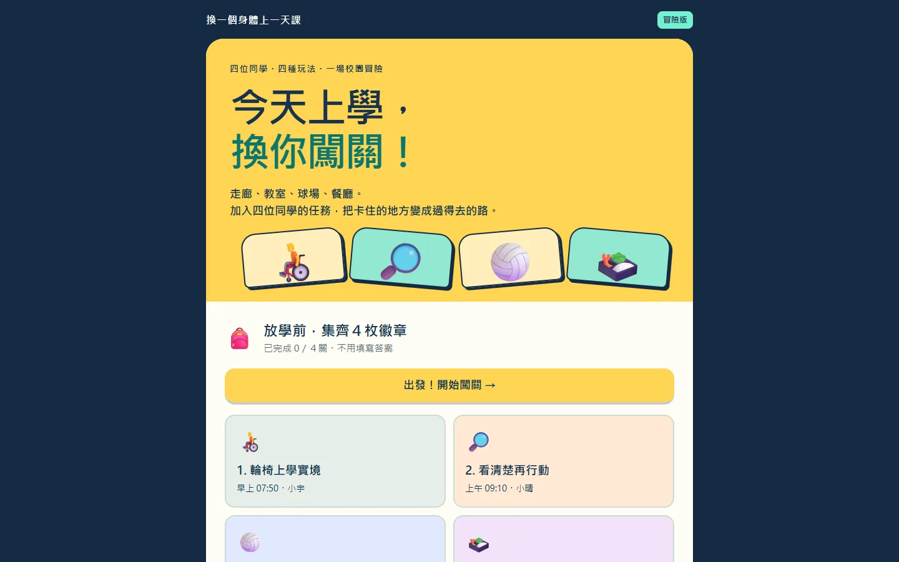

# 換一個身體上一天課｜校園任務大冒險

線上網站：https://shuan14408-ops.github.io/body-school-day/

跟著四位同學度過一天校園生活，透過遊戲親身體驗不同的身體與學習需求，並找出讓每個人都能參與的方法。

## 設計理念

- **用體驗取代說教**：與其告訴學生要體諒別人，不如讓他們親自操作，感受輪椅轉不過狹窄走廊、按鈕裝太高碰不到、聽不到隊友喊聲的處境。
- **四種需求、四種玩法**：
  - **輪椅上學實境**（小宇）：操作左右輪前進、轉彎、上坡停車，體驗走廊寬度、坡道與按鈕高度的影響。
  - **看清楚再行動**（小晴）：在反光、模糊的畫面中逐格核對物品，體驗視覺辨識的負擔。
  - **無聲球場挑戰**（小安）：看不到聲音，只能依靠手勢與燈號判斷要接球還是讓開。
  - **午餐任務切換**（小禾）：取餐途中被打斷、訂單臨時更改，體驗工作記憶與任務切換的困難。
- **重點是環境而不是缺陷**：每一關都提供輔助工具（低位按鈕、放大鏡、燈號字幕、步驟卡等），讓學生發現：卡住的原因往往是環境設計，改變環境就能讓每個人過得去。這呼應了通用設計（Universal Design）的精神。
- **不讓失敗變成挫折**：時間到可以加時，已完成的進度會保留；切換分頁時遊戲自動暫停。目的是讓學生專心找方法，而不是比快。
- **收穫徽章與反思**：每關結束都有一段發現與反思，放學時集齊四枚徽章，回顧四種方法：換一條路、看清一點、把聲音變成燈號、讓步驟留在眼前。

## 開發過程

1. 先設定學習目標：讓學生理解不同的身體與學習需求，並思考校園環境可以怎麼改善。
2. 為每一種需求設計對應的遊戲機制，讓操作本身就能帶出體驗（例如輪椅的左右輪分開控制）。
3. 使用 AI 程式開發工具協助撰寫程式，再依實際試玩的結果反覆調整難度、提示文字與輔助工具。
4. 完成後發布為單一 HTML 檔的靜態網站，部署到 GitHub Pages。

## 技術

- HTML / CSS / JavaScript（無框架）、Canvas
- 支援滑鼠、鍵盤與觸控操作

## 分支說明

- `main`：原始碼（網站檔案在 `dist/`）
- `gh-pages`：部署到 GitHub Pages 的靜態檔案
